# 딥러닝

> 1. 머신러닝은 알고리즘을 이용해 데이터를 분석하고 학습하며, 학습한 내용을 기반으로 판단이나 예측을 하였으나 딥러닝은 인간의 뇌처럼 여러 층을 가진 **인공신경망을 이용하여 머신러닝을 수행하는 것.**
> 2. 기본 층을 겹겹이 쌓아 올려 구성한 신경망(neural network)이라는 모델을 사용하여 표현 층을 학습
> 3. 층 기반 표현 학습(layered representations learning) 또는 계층적 표현 학습(hierarchical representations learning)
> 4. 일반적으로 개와 고양이 구별을 예시로 머신러닝 같은경우 동물에 대한 형태(귀,눈,입,수염 등)를 미리 컴퓨터에게 전달, 딥러닝은 개,고양이 사진 자체를 컴퓨터가 학습하도록 하는 것

#### 참고

- 참고1 : [딥러닝_학습방법](https://wikidocs.net/36033)

## Tensorflow

> 1. 구글이 공개한 대규모 숫자 계산을 해주는  머신러닝 및 딥러닝 전문 라이브러리 
>
> 2. Tensor는 다차원 행렬 계산을 의미
>
> 3. 상업적인 용도로 사용할 수 있는 오픈소스(Apache 2.0)
>
> 4. C++로 만들어진 라이브러리
>
> 5. 파이썬을 사용해서 호출할 때 오버헤드가 거의 없는 구조로 설계
>
> 6. 이미지 처리와 음향 처리 등을 할 때는 추가적으로 이미지 처리에 특화된 OpenCV 라이브러리등과 함께 사용
> 7. pip install tensorflow==1.15

#### 실습

1. [Tensorflow](https://github.com/madfalc0n/Image-analysis-and-develope/blob/master/Deep_Learning/20191230/1.0_tensorflow.ipynb)

## Keras

> 1. 머신러닝 라이브러리 Theano와 TensorFlow를 래핑한 라이브러리
>
> 2. Sequential로 딥러닝의 각 층을 add()로 추가
>
> 3. 활성화 함수, Dropout 등 add()로 간단하게 추가
>
> 4. compile()로 모델 구축
>
> 5. loss 로 최적화 함수 지정
>
> 6. fit() 로 모델에 데이터를 학습시킴
>
> 7. Keras로 머신러닝을 수행할 때 Numpy 배열 데이터를 전달해야 한다
> 8. pip install keras

## 최소제곱법

(x - x의평균)(y - y의평균)의 합 / (x - x의평균 )^2 의 합

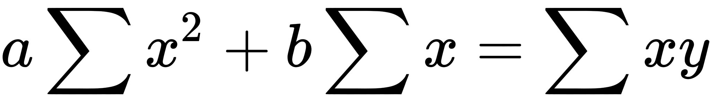

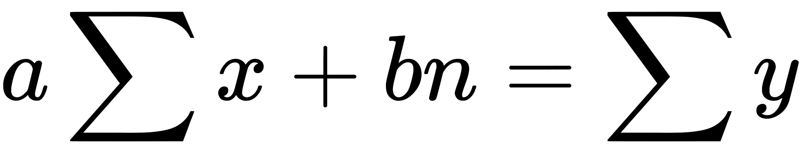

기울기: 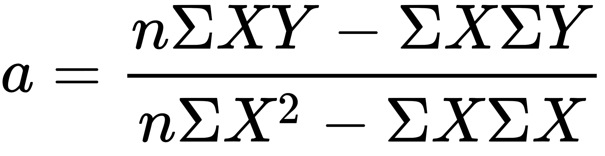

절편: 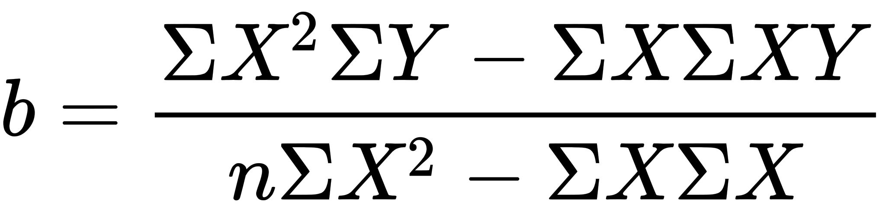

## 평균제곱오차

선형회귀에서 여러 값에 대한 평균제곱 오차

임의의 선을 그어서 만들어진 모델로부터 예측값을 뺀게 오차

(예측값-실제값)^2 의 합

## 퍼셉트론(perceptron)

> 1. 입력 값과 활성화 함수를 사용해 출력 값을 다음으로 넘기는 가장 작은 신경망 단위
>
> 2. 뉴런과 뉴런이 서로 새로운 연결을 만들기도 하고 필요에 따라 위치를 바꾸는 것처럼, 여러 층의 퍼셉트론을 서로 연결시키고 복잡하게 조합하여 주어진 입력 값에 대한 판단을 하게 하는 것

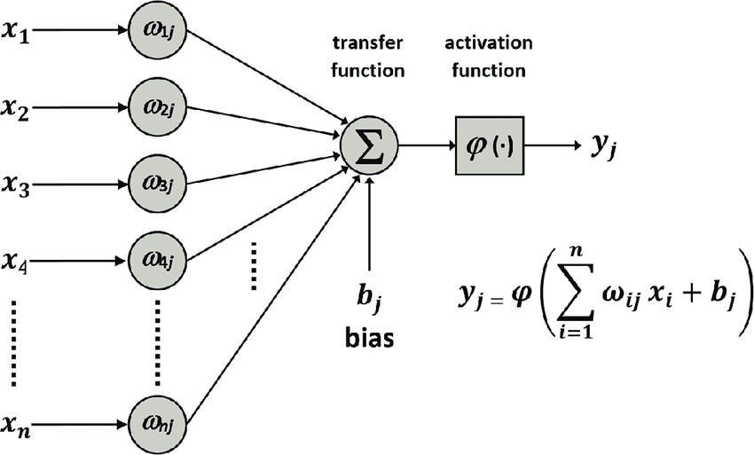

> Sheme of a perceptron (출처 : D Álvarez, 2017)

- 가중합 - 입력 값(x)과 가중치(w)의 곱을 모두 더한 값에 바이어스(b)를 더한 값

  - y = wx + b (w는 가중치,  b는 바이어스)
  

#### 실습

1. [Perceptron](https://github.com/madfalc0n/Image-analysis-and-develope/blob/master/Deep_Learning/20191230/1.3_perceptron.ipynb)

#### 참고
- 참고1 : [퍼셉트론_1](http://www.incodom.kr/%EA%B8%B0%EA%B3%84%ED%95%99%EC%8A%B5/%ED%8D%BC%EC%85%89%ED%8A%B8%EB%A1%A0)
- 참고2 : [퍼셉트론_2](https://wikidocs.net/24958)

## Gradient descent(경사 하강법)

> 1. 미분 기울기를 이용하는 **경사 하강법(gradient decent)**은 이차 함수 그래프에서 오차를 비교하여 가장 **작은 방향으로 이동시키는 방법**
>
> 2. 기본 개념은 함수의 [기울기](https://ko.wikipedia.org/wiki/기울기_(벡터))(경사)를 구하여 기울기가 낮은 쪽으로 계속 이동시켜서 [극값](https://ko.wikipedia.org/wiki/극값)에 이를 때까지 반복시키는 것

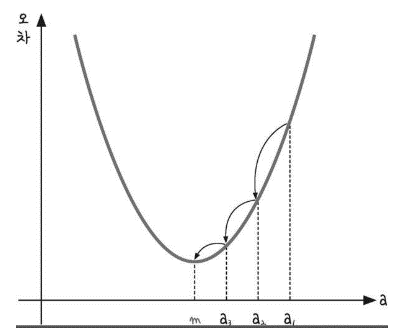

#### 평가 및 장단점

- 경사 하강법은 모든 차원과 모든 공간에서의 적용이 가능하다. 심지어 무한 차원상에서도 쓰일 수 있다. (이 경우 해당 차원이 만들어내는 공간을 [함수 공간](https://ko.wikipedia.org/wiki/함수_공간)이라고 한다.)

- 정확성을 위해서 [극값](https://ko.wikipedia.org/wiki/극값)으로 이동함에 있어 매우 많은 단계를 거쳐야하며, 주어진 함수에서의 [곡률](https://ko.wikipedia.org/wiki/곡률)에 따라서 거의 같은 위치에서 시작했음에도 불구하고 완전히 다른 결과로 이어질 수도 있다.
  - 함수 최적화 방법인 경사하강법 알고리즘은 **그리디 접근방식**을 사용한다. 이것은 즉 **휴리스틱(heuristic)**한 탐색을 하기 때문에 **국소 최적해(Local Minimum)**을 가질 위험이 있다.
  - 간단하게 예를 들어보자면,  어떤 사람이 등산을 할 때 정상을 향해서 등산을 하게 되는데 정상인 줄 알고 올라와봤더니 옆에 더 높은 봉우리가 있는 것이다.
  - 이와 같이 정상이 어디인지 모르고 일단 사람이 판단했을 때 최적의 길로 올라 갔을 때 휴리스틱한 탐색을 한다하고 사람은 봉우리에 올라갔을 때 주변을 탐색할 수 있지만
  - 기계는 그러지 못한다. 따라서 그를 해결하기 위한 매커니즘으로 **Convex Function**을 활용한다. 이를 활용하면 어디서 시작하든지 간에 우리가 원하는 지점에 갈 수 있는 것이다. 
#### 실습

1. [Gradient_descent]( https://github.com/madfalc0n/Image-analysis-and-develope/blob/master/Deep_Learning/20191230/1.1_gradient_descent.ipynb)
2. [Gradient_descent_Logistic_regression](https://github.com/madfalc0n/Image-analysis-and-develope/blob/master/Deep_Learning/20191230/1.2_gradient_descent_logistic_regression.ipynb)

#### 참고

- 참고1 : [경사하강법_1](https://ko.wikipedia.org/wiki/%EA%B2%BD%EC%82%AC_%ED%95%98%EA%B0%95%EB%B2%95)
- 참고2 : [경사하강법_2](https://gdyoon.tistory.com/9)
- 참고3 : [딥러닝_경사하강종류 ](https://wikidocs.net/36033)

## 시그모이드함수

오차 = -평균(y logh + (1-y)log(1-h))

## 오차 역전파(back propagation)

>1. 다층 퍼셉트론에서의 최적화 과정을 오차 역전파라고 부름
>
>2. 임의의 가중치를 선언하고 최소 제곱법을 이용해 오차를 구한 뒤 이 오차가 최소인 지점으로 계속해서 조금씩 이동시킴.
>
>3. 가중치에서 기울기를 빼도 값의 변화가 없을 때까지 계속해서 가중치 수정 작업을 반복하는 것

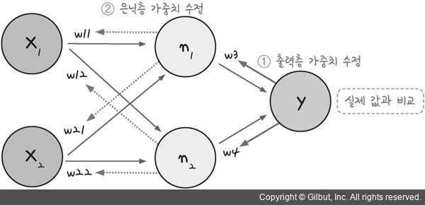

> 출처 : 모두의 딥러닝

#### 과정

1.  임의의 초기 가중치(W)를 준 뒤 결과(yout)를 계산한다.

2. 계산 결과와 우리가 원하는 값 사이의 오차를 구한다.

3. 경사 하강법을 이용해 바로 앞 가중치를 오차가 작아지는 방향으로 업데이트한다.
4. 위 과정을 더이상 오차가 줄어들지 않을 때까지 반복한다.

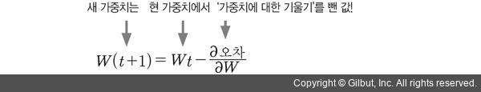
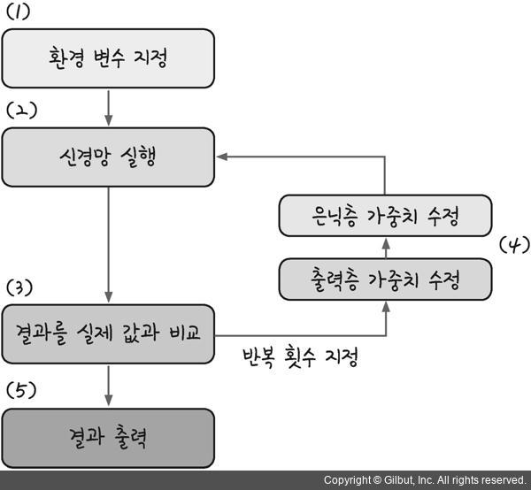

> 출처: 모두의 딥러닝

#### 문제점

1. 활성화 함수 시그모이드는 층이 늘어나면서 기울기가 중간에 0이 되어버리는 기울기 소실 문제가 발생한다.
2. 시그모이드를 미분하면 최대치가 0.3이며 1보다 작으므로 계속 곱하다 보면 0에 가까워진다.
3. 즉 시그모이드는 층을 거쳐 갈수록 기울기가 사라져 가중치를 수정하기 어려워 진다.

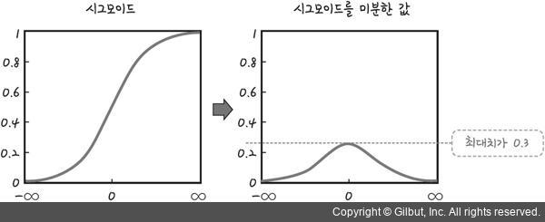

> 출처: 모두의 딥러닝

#### 대안

1. 다른 함수로 대체

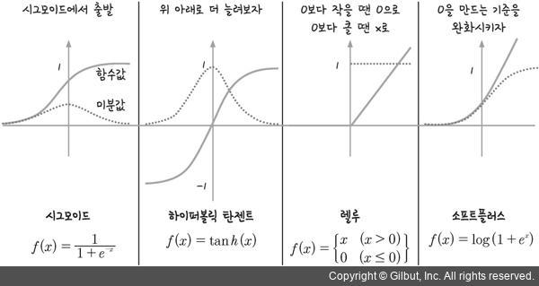

> 출처: 모두의 딥러닝

 - 하이퍼볼릭 탄젠트(tanh) - 시그모이드 함수의 범위를 -1에서 1로 확장, 미분한 값의 범위가 함께 확장 되는 효과를 가져왔다. 여전히 1보다 작은 값이 존재하므로 기울기 소실 문제는 사라지지 않는다.

 - 렐루(ReLU) - x가 0보다 작을 때는 모든 값을 0으로 처리하고, 0보다 큰 값은 x를 그대로 사용하는 방법 x가 0보다 크기만 하면 미분 값이 1이 된다. 따라서 여러 은닉층을 거치며 곱해지더라도 맨 처음 층까지 사라지지 않고 남아있을 수 있다.

