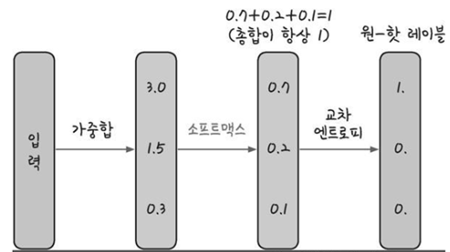
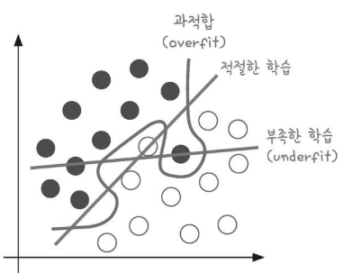
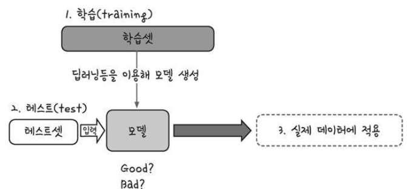
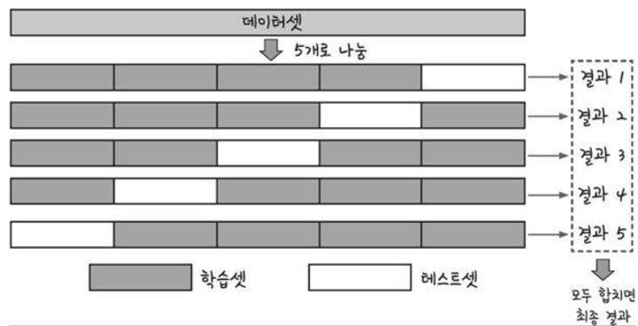

## 경사 하강법의 종류

> 케라스에서는 다양한 경사하강법을 제공한다.
>
> 경사 하강법은 정확하게 가중치를 찾아가지만 한번 업데이트 할 때마다 전체 데이터를 미분해야 한다는 단점이 있다. 즉 계산량이 매우 많다.

### 확률적 경사 하강법

전체 데이터를 사용하는것이 아니라 랜덤하게 추출한 일부 데이터를 사용하였다.

### 모멘텀을 적용한 확률적 경사 하강법


## tensorflow

#### 그래프와 세션의 이해

- 예시

```python
import tensorflow as tf

a = tf.constant([5],dtype=tf.float32)
b = tf.constant([10],dtype=tf.float32)
c = tf.constant([2],dtype=tf.float32)
d = a*b+c
print d
#출력: Tensor("add_8:0", shape=(1,), dtype=float32)
#a*b+c 의 값이 아닌 Tensor...로 시작하는 엉뚱한 값이 나옴

출처: https://bcho.tistory.com/1150 [조대협의 블로그]
```

이는  `d= a*b+c` 에서  계산을 수행하는 것이 아닌  `a*b+c` 의 그래프를 정의하는 것이다.

출력하기 위해선 아래의 명령어를 추가적으로 입력해야 함

```python
sess = tf.Session()
result = sess.run(d)
print result
```

출처: https://bcho.tistory.com/1150


#### tensorboard 실행방법

1. 텐서플로우를 통한 그래프 파일 생성 

   - 예시 : tw = tf.summary.FileWriter("log_dir", graph=sess.graph)

2. 아나콘다 프롬프트 실행

3. 다음과 같이 명령어 입력

   - tensorboard --logdir=./log_dir

   ```bash
   (base) C:\Users\student\KMH\Image-analysis-and-develope\Deep_Learning\20191231>tensorboard --logdir=./log_dir
   2019-12-31 10:53:54.433062: W tensorflow/stream_executor/platform/default/dso_loader.cc:55] Could not load dynamic library 'cudart64_100.dll'; dlerror: cudart64_100.dll not found
   2019-12-31 10:53:54.437749: I tensorflow/stream_executor/cuda/cudart_stub.cc:29] Ignore above cudart dlerror if you do not have a GPU set up on your machine.
   TensorBoard 1.15.0 at http://M50417:6006/ (Press CTRL+C to quit)
   #종료는 컨씨
   ```

   

## SVM 과 Keras 를 통한 BMI 판정

> 모르겟다.....


## 소프트맥스 함수

> 합계가 1인 형태로 바꿔서 계산해주는 함수




## 과적합

1. 모델이 학습 데이터셋 안에서는 일정 수준 이상의 예측 정확도를 보이지만, 새로운 데이터에 적용하면 잘 맞지 않는 것
2. 과적합은 층이 너무 많거나 변수가 복잡해서 발생하기도 하고 테스트셋과 학습셋이 중복될 때 생기기도 합니다
3. 과적합을 방지 방법 - 학습을 하는 데이터셋과 이를 테스트할 데이터셋을 완전히 구분한 다음 학습과 동시에 테스트를 병행하며 진행






## K겹 교차 검증

> k겹 교차 검증이란 데이터셋을 여러 개로 나누어 하나씩 테스트셋으로 사용하고 나머지를 모두 합해서 학습셋으로 사용하는 방법
>
> 데이터가 충분치 않은 경우, 데이터의 100%를 테스트셋으로 사용할 수 있습니다




