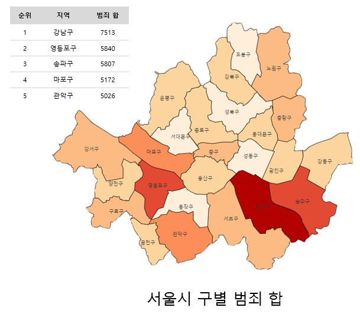
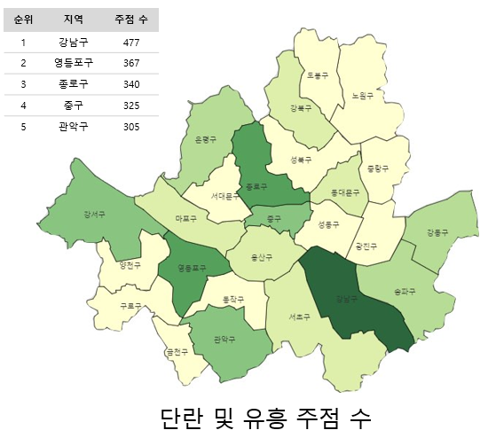
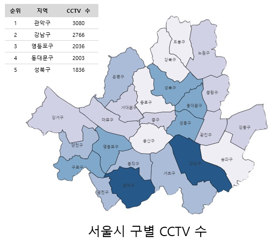
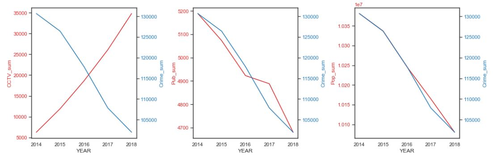
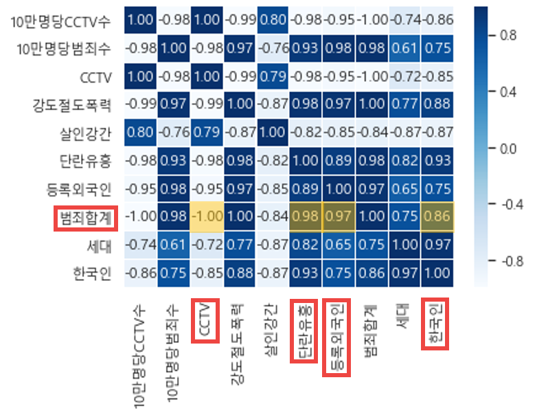
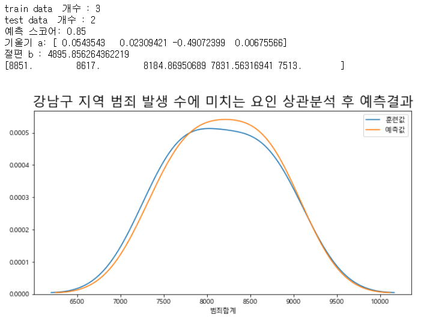

# 이미지 분석 및 개발 실무 과정 1차 프로젝트

## 1. 주제 : 공공데이터를 활용한 서울시 자치구별 범죄 상관관계 분석 및 예측

## 2. 기한 : 2020년 1월 03일(금)

## 3. 데이터 출처 정보:

1. [서울시 5대 범죄 발생현황 통계(14년~18년)](https://data.seoul.go.kr/dataList/datasetView.do?infId=316&srvType=C&serviceKind=2)
2. [서울시 자치구 년도별 CCTV 설치 현황(11년~ 18년)](https://data.seoul.go.kr/dataList/datasetView.do?infId=OA-2734&srvType=F&serviceKind=1&currentPageNo=1)
3. [서울시 주민등록인구 (구별) 통계](https://data.seoul.go.kr/dataList/datasetView.do?serviceKind=2&infId=419&srvType=S&stcSrl=419)
4. [서울시 자치구 별 위도,경도](https://github.com/southkorea/seoul-maps/tree/master/juso/2015/json)
5. [서울시 식품위생업 현황 (구별) 통계(2014~2018)](https://data.seoul.go.kr/dataList/datasetView.do?infId=33&srvType=C&serviceKind=2&currentPageNo=null)

## 4. History

### 12월 28일

- 진행상황

1. 공공 데이터 전처리(CCTV 설치 수, 인구 수, 범죄 발생 수) 및 데이터 시각화(CCTV 와 범죄 발생 수 관계, 인구수 와 범죄 발생 수 관계) 진행

### 12월 29일 ~ 30일

- 진행상황

  1. 데이터 시각화를 위한 geopandas 모듈 숙지
  2. 서울시 자치구 별 위도,경도 데이터 확인(위 데이터 참고)
  3. 강사님 피드백을 통해 분석방향 및 데이터 시각화 방향 제시
     1. 지역별 10만 인구당 CCTV 설치 수 및 범죄 발생 수 
     2. 각 지역별 해외인구 수에 따른 범죄수
     3. 지역별 숙박업소 및 식품점(음식점, 유흥업소 등) 분포에 따른 범죄수
     4. 지역별 범죄종류(살인,절도,폭행 등)에 따른 발생 수
  4. 서울 지역 행정구역 별 위도 및 경도 데이터와 folium 모듈을 이용하여 행정구역별 범죄 합계 색깔 별로 표시

### 12월 31일 ~ 1월 2일

- 진행상황
  1. 데이터별로 구조와 형식이 달라 하나로 병합하는 작업 진행(전처리 작업)
  
  2. folium 모듈을 통해 서울 자치구별로 다음의 합계데이터를 지도에 표시하였음
  
     1. 범죄 총 합
     2. 범죄 종류별(강력범죄, 경범죄) 합 
     3. 인구(한국인, 외국인) 합
     4. CCTV 합
     5. 단란 및 유흥주점 합
     
     
  
  3. 추가적인 분석을 위해 matplot 라이브러리를 통해 CCTV- 범죄, 인구수-범죄, 단란 및 유흥- 범죄 간의 상관관계 그래프 추출
  
  
  4. Seaborn 라이브러리를 통한 범죄 수에 미치는 요인을 분석하기 위해 Heatmap 활용
  
  5. '강남구' 지역을 Heatmap을 통해 상관관계가 높은 요인을 분석함, 선형회귀 알고리즘을 통해 학습 및 예측 결과 점수 0.85를 얻음
  
     

## 5. 산출물

0. [데이터 전처리작업](https://github.com/madfalc0n/Image-analysis-and-develope/tree/master/project/main/0.Data_preprocessing.ipynb)
1. [EDA_1_그래프시각화](https://github.com/madfalc0n/Image-analysis-and-develope/tree/master/project/main/1.Exploratory_Data_Analysis_1(graph).ipynb)
2. [EDA_2_folium을 활용한 지도생성](https://github.com/madfalc0n/Image-analysis-and-develope/tree/master/project/main/2.Exploratory_Data_Analysis_2(folium_map).ipynb)
3. [선형회귀알고리즘을 이용한 모델링](https://github.com/madfalc0n/Image-analysis-and-develope/tree/master/project/main/3.Modeling(linear_regression).ipynb)