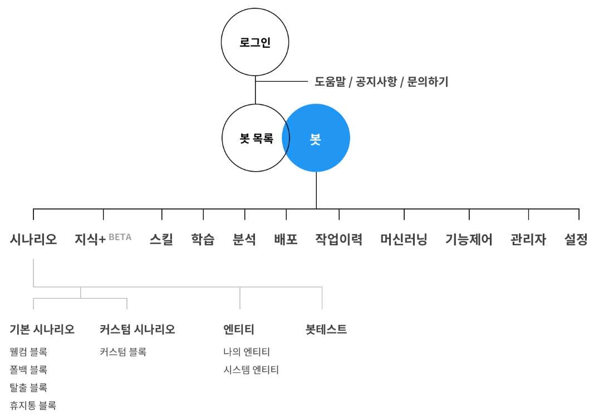

# 오픈빌더를 통한 챗봇만들기

> 카카오 API 이용해서 사용할 예정

> 출처: [카카오i 오픈빌더](https://i.kakao.com/docs/key-concepts-feedback#%ED%95%99%EC%8A%B5%EB%8C%80%EA%B8%B0https://i.kakao.com/docs/key-concepts-feedback#학습대기) , 각 항목별로 설명이 되어 있다. 참고해라

- 카카오톡 오픈빌더는 위의 시나리오로 동작함.
- 시나리오별 각 항목을 블록(인텐트)으로 나뉨

1. 플라스크 서버
2. 명함 서버
3. 

## 장고

## Docker?

가상 머신 vs 컨테이너

OS레벨 -> 어플리케이션 

가상머신 오버헤드가 10퍼이상이었다면 컨테이너는 1퍼센트 미만

경제적이다

독립적이다

1. 리눅스 상에서 컨테이너 단위로 서버를 구동
2. Docker 이미지를 통해 여러 컨테이너 구동 가능
3. 컨테이너 내에서 동작하는 프로세스를 하나의 그룹으로 관리하며 그룹별로 각각 다른 파일 시스템과 호스트명, 네트워크 등이 할당됨
4. 서로 다른 그룹간 프로세스와 파일접근 불가
5. 컨테이너를 독립된 공간으로 관리

### 오버레이 파일시스템

가상으로 보일수 있게하는 기능 

바로가기 하는 것과 같은거

### Cgroup(컨트롤 그룹)

컨테이너 하나에 대한 리소스를 컨트롤함

ex 컨테이너 1에 얼마의 cpu 할당, 메모리 얼마 할당, 용량 얼마 할당 가능

격리가 가능, 보안에 용이

클라우드 기술의 근본

- ps aux 
  - 프로세스 할당량 표시

- 자원 격리(unshare 명령어, 네임스페이스를 분리)
  - 부모프로세스와 공유되지않는 네임스페이스에서 실행시켜줌

## 리버스 프록시

외부에서 7777로 들어오면 80으로 보내주겠다

## 실습

별자리봇 검색해보기

## POST 와 GET 방식의 차이

### POST

파라미터를 URL에 담아서 보내지 않고 BODY(request) 부분에 넣어서 보냄 

URL로 데이터가 가는지 안가는지 모름

데이터 길이가 무제한이다

### GET

URL로 모든데이터가 넘어가는 방식

http 주소뒤에 파라미터(?)를 붙여서  

긴 데이터를 보낼수 없다(단점)

### post man 설치

## REST API

## CRUD

>  대부분의 컴퓨터 소프트웨어가 가지는 기본적인 데이터 처리 기능인 Create(생성), Read(읽기), Update(갱신), Delete(삭제)를 묶어서 일컫는 말이다. 사용자 인터페이스가 갖추어야 할 기능(정보의 참조/검색/갱신)을 가리키는 용어로서도 사용된다.

### 이모지

그림도 아니면서 글도아닌 텍스트

텍스트 형의 응답, 당신은 용띠 입니다.

이미지 형의 응답, 용의 그림을 주는거지