# 카카오톡 오픈빌더를 이용한 명함인식 챗봇 만들기

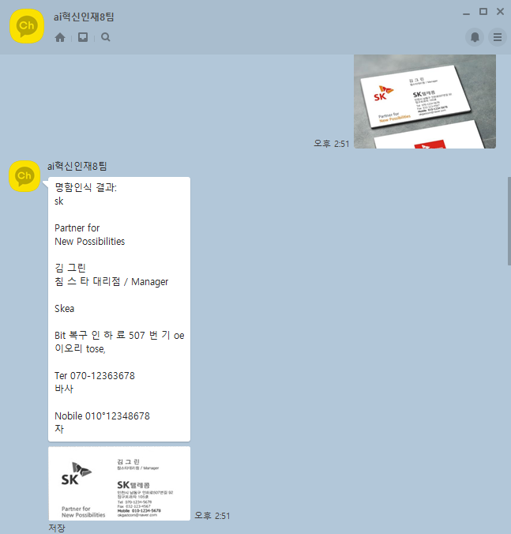

> 입력에 따른 문장 검출화면


## 구현 시 사용한 툴(프로그램, 언어, 프레임워크)

- 챗봇서버
  - 카카오i
- 명함저장 인식 및 저장을 위한 내부서버
  - 플라스크

- 명함 속 이미지 문자 검출을 위한 프레임워크
  - tesseract
- 외부에서 내부서버로 도메인 접근용
  - ngrok


## 필독!! 구축 전 알아둬야 할 사항

- 카카오 챗봇을 사용하기 위해서는 OBT 참여 신청이 필요하며 신청 후 6일이내로 승인이 된다.
- 만약 승인대기중이라면 **구축을 할 수 없다..**


## 정의

- 카카오i
  - AI 핵심 기술이 결합된 카카오의 통합 인공지능 플랫폼이며 대화상대의 입력에 따라 원하는 답을 하도록 설정이 가능하다.
  - Json 형식을 통해 값을 주고받으면서 서버와 연계가 가능하다.
- 플라스크
  - 파이썬에서 제공하는 웹 프레임워크이며 이 외에도 유사한 장고(Django)가 있다.
  - 간단하게 웹 서버를 구현할 수 있다.
- tesseract
  - 광학문자인식 엔진으로 문자를 인식하기위한 오픈소스 모듈이다.
- ngrok
  - 임의의 도메인을 생성하여 8시간동안 외부에서 접근가능하도록 해주는 프로그램이다.
  - 돈내면 24시간 유지할 수 있다.


## 동작 방식

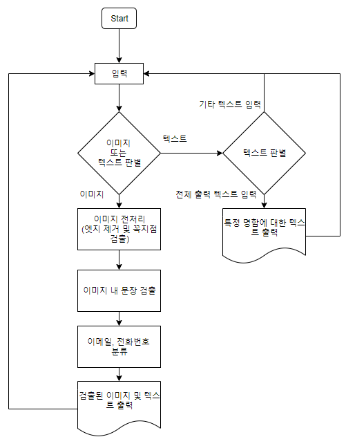

> 동작 방식은 다음과 같다...너무 간단하게 적은듯 하다...

1. 사용자로부터 입력 받을 때 이미지인지 텍스트인지 판단
   1. 텍스트일 경우 일부 명령어 제외하고는 처음부터 다시 진행
   2. 텍스트가 전체 명함 출력에 대한 명령어일 경우 저장되어 있는 명함 출력
2. 이미지일 경우 해당 이미지가 명함인지 판단
   1. 이미지에 포함된 엣지 제거 및 approx(꼭지점) 추출
   2. 꼭지점이 4개가 아닐경우 명함이 아닌것으로 판단하여 처음부터 다시 진행
   3. 꼭지점이 4개인 경우 명함에 포함된 문자 추출
   4. 추출된 이미지와 이메일, 전화번호 저장


## 구축

### 1. 카카오톡 챗봇 만들기

1. [카카오i](https://i.kakao.com/openbuilder) 에 접속하여 회원가입 후 OBT 참여를 신청요청을 한다(6일 이내로 생성이 된다고 한다).

   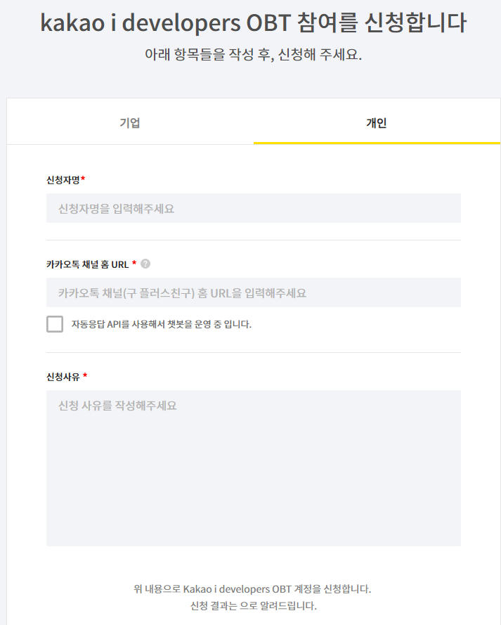

   > 참여신청 양식, 꼼꼼하게 적어주지 않으면 반려된다.

2. 계정이 생성되었다고 가정하고, 카카오i 에서 오픈빌더를 클릭하고 챗봇을 생성한다.

   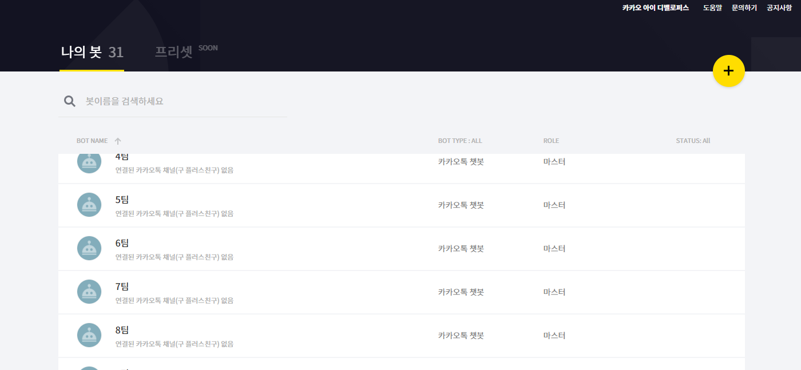

   > 생성된 봇 리스트

3. 생성된 봇 클릭 후 도움말을 참고하여 사용자 입력에 따른 응답표현을 작성한다.

   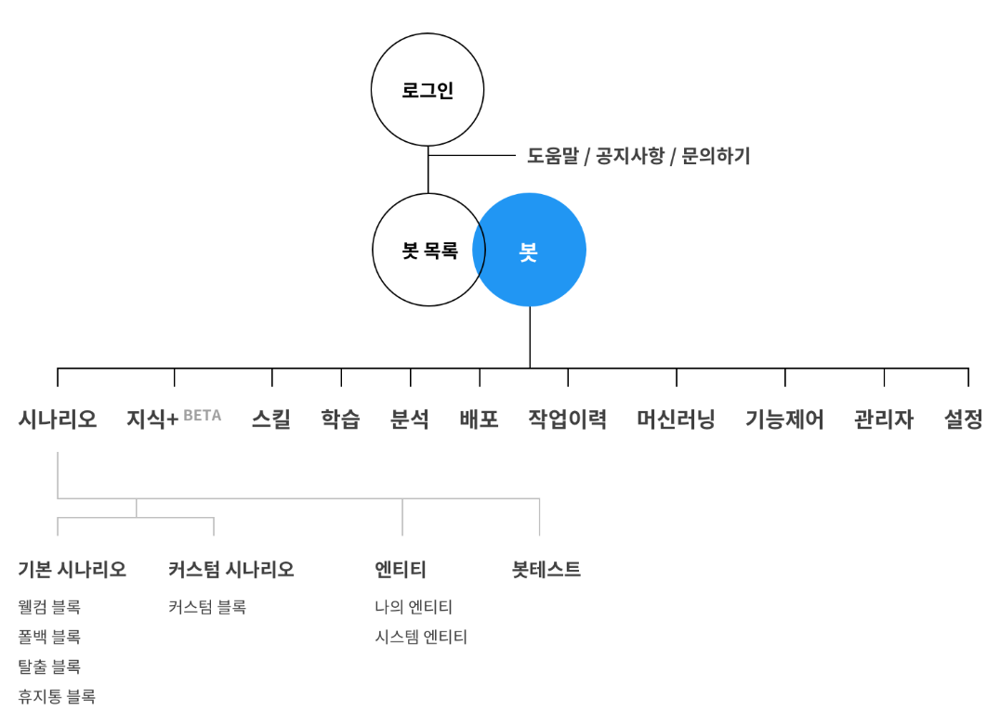

   - [카카오i 도움말](https://i.kakao.com/docs/getting-started-overview) 에 각 기능에 대한 설명과 응용방법이 있으니 무조건 참고한다.

   - 시나리오별 각 항목을 블록(인텐트)으로 나뉜다.

   - 동작은 사용자가 봇과 연결되는 경우 웰컴블록을 반환하며 사용자의 요청에 따라 풀백/커스텀/탈출 블록으로 나뉜다.

   - 봇의 동작방식을 다음과 같이 지정하였다.

     1. 사용자가 봇에게 메세지를 보낼 경우

        - 커스텀 블록으로 분류됨

          - `명함조회` 블록과 `명함개별조회` 블록을 생성
   
          - 명함조회 블록은 사용자가 `명함조회` 를 입력한 경우 서버에 저장되어 있는 명함 리스트 출력
   
            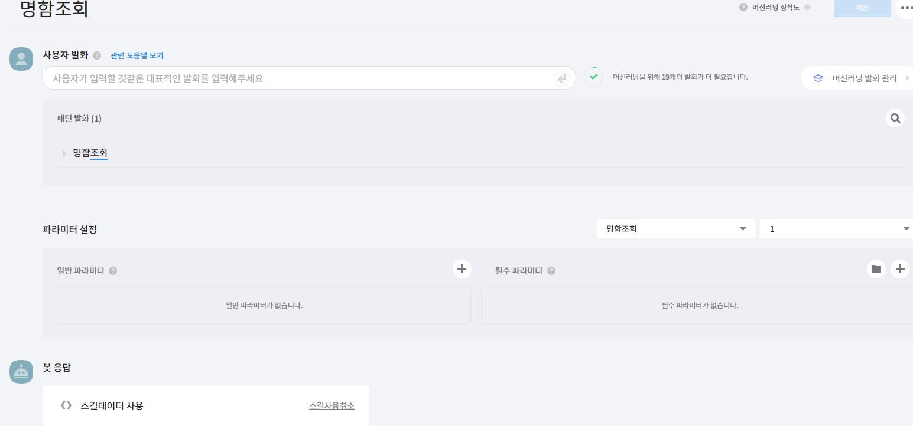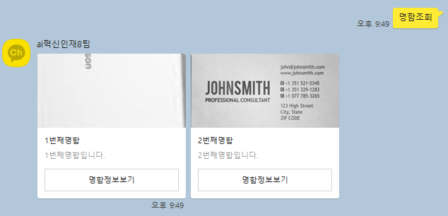
     
            > 봇 응답으로 스킬 데이터가 지정되어 있으며 `명함조회`라는 스킬데이터가 동작하도록 지정 되어 있다.
     
            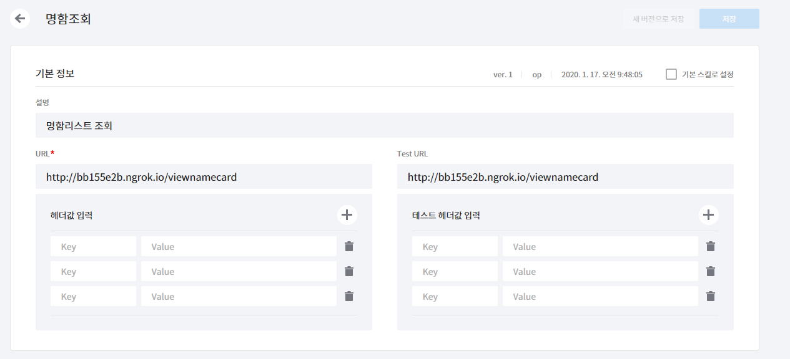
     
            > URL 은 ngrok을 통해 생성된 임의의 주소로 외부에서 해당 URL 을 접속할 경우 내부 서버로 접속이 가능하다. 서버의 `/viewnamecard` 에서 요청받아 모든 명함을 출력한다.
     
          - `명함개별조회`는 `파라미터`를 통해 서버에 저장되어 있는 명함을 개별적으로 호출하여 정보를 확인할 수 있도록 한다.`/view_per_namecard` 에서 요청받아 개별 명함을 출력한다.
     
            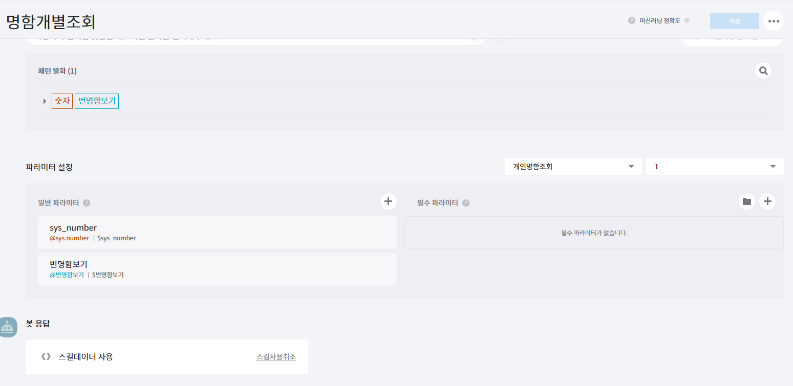
            
            > 파라미터는 특정발화에 대해 유사한 입력도 똑같은 발화로 받아들이는 설정이다.
            >
            > ex) `번명함출력`으로 지정하고 파라미터로 `번 명함 보여줘`, `번 명함` 을 등록해놓으면 모두 똑같은 발화로 처리한다.
            
            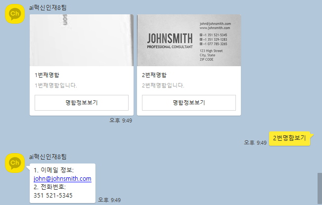
            
     
        - 봇은 명함사진을 보내라고 응답
     
          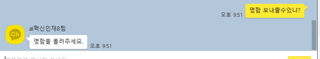
     
     2. 사용자가 봇에게 명함사진을 보낼 경우
     
        - 이미지는 `풀백 블록`으로 분류(텍스트 같은경우 커스텀블록이 사용가능하나 이미지는 분류가 불가능하여 풀백 블록으로 분류된다)
     
          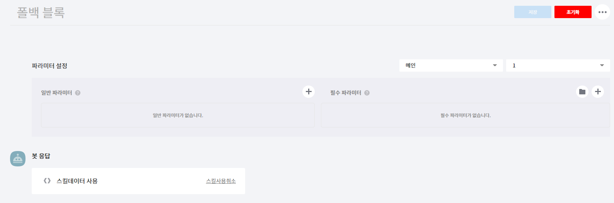
     
          > 풀백 블록은 `/main`에서 요청받아 문자 또는 텍스트를 판별하여 응답을 준다. 사진일 경우 명함 검출, 이미지인 경우 명함을 올려달라는 응답을 준다.
     
        - 해당 이미지를 판독하여 명함 내에 있는 문자를 인식
        
          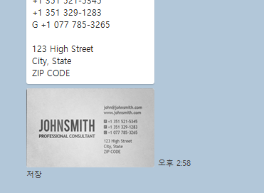
        
          > 인식 후 검출된 이미지와 문자를 응답
        
        - 문자를 전화번호와 이메일로 분류하여 명함조회시 출력
        
          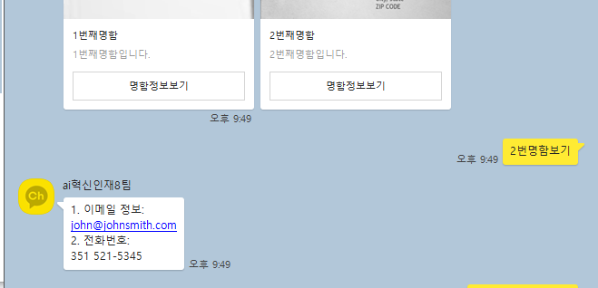
   
   

### 2. 플라스크와 ngrok을 통한 웹 서버 구축

#### Tesseract 설치 및 Flask 웹 서버 구축 후 실행

> 명함 인식에 따른 문장 검출 및 웹 서버 구축 코드 부분은 너무 길어서 따로 링크를 걸어두겠다. 
>
> 챗봇 구축을 2일만에 급만들다보니 코드의 퀄리티가 너무 떨어진다..우선 Tesseract를 따로 설치를 해주어야 한다. Flask 관련해서 함수 사용법에 궁금한 경우 [Flask 공식 홈페이지](https://www.palletsprojects.com/p/flask/)를 참조해라

#### [파이썬 구축코드](create_image_detection.py)

1. [python에서 tesseract를 이용해 OCR 수행하기]([https://junyoung-jamong.github.io/computer/vision,/ocr/2019/01/30/Python%EC%97%90%EC%84%9C-Tesseract%EB%A5%BC-%EC%9D%B4%EC%9A%A9%ED%95%B4-OCR-%EC%88%98%ED%96%89%ED%95%98%EA%B8%B0.html](https://junyoung-jamong.github.io/computer/vision,/ocr/2019/01/30/Python에서-Tesseract를-이용해-OCR-수행하기.html))에서 Tesseract를 설치한다.

2. `cmd` 또는 `아나콘다 프롬프트`에서 코드가 있는 디렉토리로 이동 후 아래와 같이 실행한다.

   ```bash
   (base) C:\Users\student\KMH\Image-analysis-and-develope\project\2.Create_a_chatbot_with_Open_Builder>set flask_APP=create_image_detection.py
   
   (base) C:\Users\student\KMH\Image-analysis-and-develope\project\2.Create_a_chatbot_with_Open_Builder>flask run
    * Serving Flask app "create_image_detection.py"
    * Environment: production
      WARNING: This is a development server. Do not use it in a production deployment.
      Use a production WSGI server instead.
    * Debug mode: off
    * Running on http://127.0.0.1:5000/ (Press CTRL+C to quit)
    
    #위 정보가 뜬다면 제대로 성공한 것이다.
   ```

    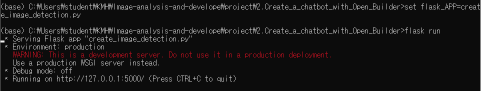


#### ngrok 설치 및 실행

1. [ngrok](https://ngrok.com/)에 접속하여 프로그램을 다운받는다.

2. 압축풀고 `cmd 프롬프트`를 통해  설치된 경로로 이동 후 다음과 같이 입력한다.

   ```bash
   C:\Users\student\Downloads\ngrok-stable-windows-amd64>ngrok http 5000
   ```

   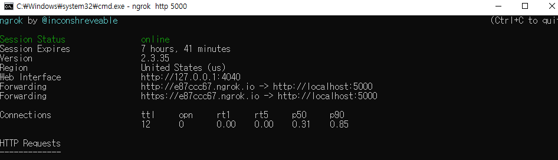

   > 7시간 41분동안 외부에서 `http://e87ccc67.ngrok.io` 를 입력하면 내부 서버(`localhost:5000`)으로 접속 가능하다. flask 는 기본적으로 5000 포트를 이용한다. flask를 통해 웹서버를 구축하지 않았다면 접속이 불가능하다.


## 후기

> 1. 급하게 만들다보니 퀄리티가 많이 떨어졌다. 하지만 작정하고 만들면 창업에 도움이 되지 않을까 생각했다.
> 2. 명함 문자를 인식하는 것은 생각한것 만큼 정확도가 너무 많이 떨어진다...비전의 현실을 깨닫는 계기였다.
> 3. 그래도 다른조에 비해 정확률이 제일 높아 커피쿠폰을 받아 뿌듯했다.