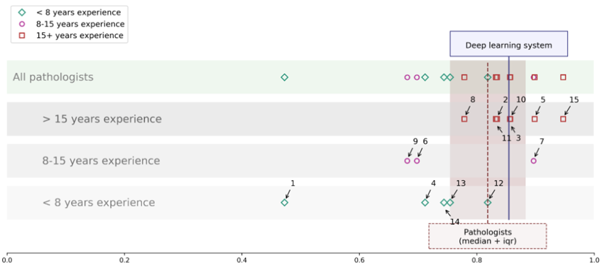

# 딥러닝 모델을 이용한 전립선 암 검체 프로그램

## 1. 선정배경

현재 전립선 암은 세계 남성 중 2번째로 많이 발생하는 암으로, 2019년에 발표된 중앙 암 등록본부 자료에 의하면 우리나라 전체 암 발생의 5.5%로 7위, 남성에게 발생하는 암중 4위를 차지하는 암이다. 전립선 암은 초기에 별다른 증상이 없고, 다른 암에 비해 비교적 진행 속도가 느리기 때문에 주변 장기로 전이되고 나서야 증상이 나타난다. 이로 인해 조기 진단이 어렵고, 정확한 진단을 하는 것이 중요한 과제가 되었다.

전립선 암은 병리학자가 전립선 생검 조직을 판단하여 Gleason 등급으로 판별하여, 최종 ISUP 점수가 결정된다. 이 최종 ISUP 점수를 기준으로 치료 방법이 결정된다. 하지만 전립선 생검 조직  Gleason 등급 판별의 어려움과 병리학 자 간의 의견 차이로 인하여 오진이나 불필요한 진료가 발생한다.

[출처: 병리학자와 AI의 전립선 암 판별 정확도](https://www.wouterbulten.nl/blog/tech/automated-gleason-grading-deep-learning/)

이와 같은 문제를 해결하기 위해 세계적으로AI를 사용하여 전립선 암 판별 연구와 각종 대회를 진행하고 있다.  Kaggle – Prostate cANcer graDe Assessment (이하PANDA) 또한 전립선 암 판별을 하는 대회로 프로젝트 기간(2020.04.27~06.18) 동안 PANDA를 활용하여 전립선 암 예측 Model의 정확도를 90% 달성하고, 예측 Model을 활용하여 전립선 생검 조직 진단에 도움이 되는 프로그램을 제작하고자 한다

## 2. 프로젝트 목표

목표는 전립선에 대한 암 등급(ISUP Grade)을 예측하고, 암에 대한 영역을 프로그램을 통해 표시하는 것이다.

## 3. 프로젝트 범위

