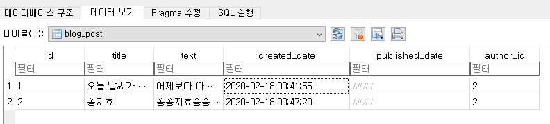
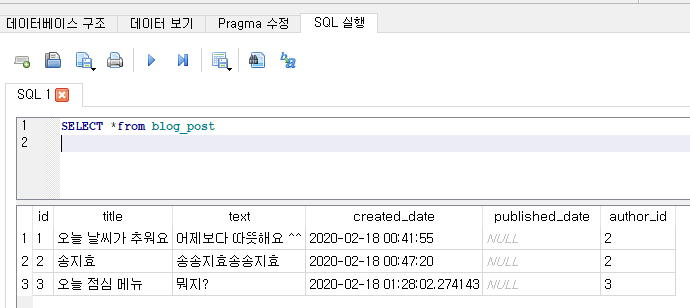
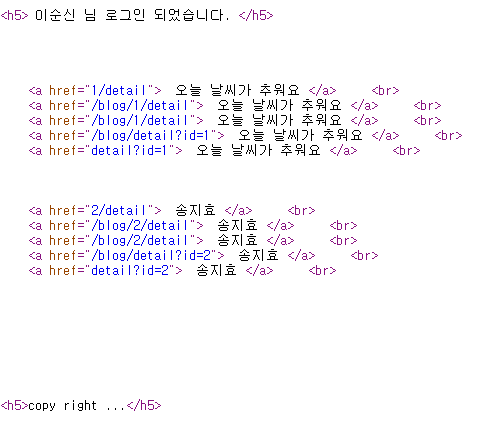

# 2020-02-18 블로그 만들기

오늘 블로그를 만들기 위한 포스트 기능(db 생성, 포스트 추가, 수정 )을 구현해보는 실습을 가짐


## 초기설정

1. `python manage.py startapp blog`

2. `mysite - settings.py`에 `INSTALLED_APPS` 항목에 아래와 같이 `blog`추가

   ```python
   INSTALLED_APPS = [
       'django.contrib.admin',
       'django.contrib.auth',
       'django.contrib.contenttypes',
       'django.contrib.sessions',
       'django.contrib.messages',
       'django.contrib.staticfiles',
       'django_extensions',
       'myapp',
       'blog',
   ]
   ```

   

3. `blog - models.py`에 아래와 같이 코드 작성

   ```python
   from django.db import models
   from django.utils import timezone
   
   
   # Create your models here.
   
   class Post(models.Model): # 기본적으로 제공된 소스
       author = models.ForeignKey('auth.User', on_delete=models.CASCADE) #auth.User는 시스템이 만든 테이블 , cascade 단계별로 이루어진 , 원래 특정 유저와 관련된거 다 지워야 함, on_delete 는 해당 유저 삭제시 같이 삭제하라는 옵션
       title = models.CharField(max_length=200)
       text = models.TextField()  # 글자수에 제한 없는 텍스트
       created_date = models.DateTimeField(
           default=timezone.now)  # 날짜와 시간
       published_date = models.DateTimeField(
           blank=True, null=True) #  필드가 폼에서 빈 채로 저장되는 것을 허용, DB 필드에 NULL 필드 허용할건지(DB관점에서) , blank는 빈값을 허용할 건지(장고 form에서 )
   
       def publish(self):
           self.published_date = timezone.now() 
           self.save()
   
       def __str__(self):
           return self.title
   
   ```

4. `blog - admin.py`에 아래와 같이 코드 작성

   ```python
   from django.contrib import admin
   from blog.models import Post
   
   # Register your models here.
   admin.site.register(Post)
   ```

5. 쉘에서 `python manage.py makemigrations blog` 입력 후 `python manage.py migrate` 입력

   * models.py 가 수정될 경우 항상 `makemigrations` 를 적용해야하고(미리 db에 적용할 대상을 대기 시켜놓는다고 생각하면 됨)
   * db에 실제로 적용할 경우 `migrate`를 입력하면 된다. 

   ```python
   (base) C:\Users\student\KMH\Image-analysis-and-develope\WEB\20200218\mysite>python manage.py makemigrations blog
   Migrations for 'blog':
     blog\migrations\0001_initial.py
   
      - Create model Post
   
   (base) C:\Users\student\KMH\Image-analysis-and-develope\WEB\20200218\mysite>python manage.py migrate
   Operations to perform:
     Apply all migrations: admin, auth, blog, contenttypes, myapp, sessions
   Running migrations:
     Applying blog.0001_initial... OK
   
   ```

6. runserver 후 post 해보기

7. SQL 브라우저에서 확인해보기



실제 DB에 저장된 테이블... 약간 ORM에서 무슨짓을 했나 확인해 볼 필요성이 있다.

장고는 `id`라는 필드를 **항상** 생성한다. Foreignkey가 붙여지는 필드는 끝에 `_id`가 붙게된다(author이 **author_id**로 변함).


8. 쉘에서 `python manage.py shell_plus --notebook` 입력
   - 장고 DB를 주피터 노트북에서 테스트 해볼 수 있다.

```python
(base) C:\Users\student\KMH\Image-analysis-and-develope\WEB\20200218\mysite>python manage.py shell_plus --notebook
[I 10:09:40.404 NotebookApp] [jupyter_nbextensions_configurator] enabled 0.4.1
[I 10:09:40.451 NotebookApp] JupyterLab extension loaded from C:\ProgramData\Anaconda3\lib\site-packages\jupyterlab
[I 10:09:40.452 NotebookApp] JupyterLab application directory is C:\ProgramData\Anaconda3\share\jupyter\lab
[I 10:09:40.465 NotebookApp] Serving notebooks from local directory: C:\Users\student\KMH\Image-analysis-and-develope\WEB\20200218\mysite
[I 10:09:40.465 NotebookApp] The Jupyter Notebook is running at:
[I 10:09:40.466 NotebookApp] http://localhost:8888/?token=b626fef2110e46564d34fa4d7af693d4b8c1d77531c71be3
[I 10:09:40.466 NotebookApp]  or http://127.0.0.1:8888/?token=b626fef2110e46564d34fa4d7af693d4b8c1d77531c71be3
[I 10:09:40.466 NotebookApp] Use Control-C to stop this server and shut down all kernels (twice to skip confirmation).
[C 10:09:40.515 NotebookApp]

    To access the notebook, open this file in a browser:
        file:///C:/Users/student/AppData/Roaming/jupyter/runtime/nbserver-3752-open.html
    Or copy and paste one of these URLs:
        http://localhost:8888/?token=b626fef2110e46564d34fa4d7af693d4b8c1d77531c71be3
     or http://127.0.0.1:8888/?token=b626fef2110e46564d34fa4d7af693d4b8c1d77531c71be3
```


## POST 레코드를 생성하는 코드 작성

* 장고DB를 주피터 노트북에서 먼저 테스트를 해보기 위한 코드(데이터 입력 및 출력)

  ```python
  from blog.models import Post # Post 클래스 호출 
  from django.contrib.auth.models import User #시스템 테이블 불러오는 모듈
  
  User.objects.all() #<QuerySet [<User: home>, <User: 이순신>, <User: 김맹만>]>
  u = User.objects.all().get(username='김맹만')
  p = Post(title='오늘 점심 메뉴', text='뭐지?', author=u) 
  print(p) #오늘 점심 메뉴
  p.save()
  ```



`author`를 작성해주면 `author_id`는 자동으로 들어간다.


## 실습 최종 결과


메인 urls.py

```python
"""mysite URL Configuration

The `urlpatterns` list routes URLs to views. For more information please see:
    https://docs.djangoproject.com/en/3.0/topics/http/urls/
Examples:
Function views
    1. Add an import:  from my_app import views
    2. Add a URL to urlpatterns:  path('', views.home, name='home')
Class-based views
    1. Add an import:  from other_app.views import Home
    2. Add a URL to urlpatterns:  path('', Home.as_view(), name='home')
Including another URLconf
    1. Import the include() function: from django.urls import include, path
    2. Add a URL to urlpatterns:  path('blog/', include('blog.urls'))
"""
from django.contrib import admin
from django.urls import path, include

urlpatterns = [
    path('',include('myapp.urls')), #사용자가만든 myapp 폴더 내 urls.py를 include 하라는 의미, 내가만든 어플리케이션을 참고해서 추가시켜주라는 의미로해석하면 됨
    path('ajax/',include('ajax.urls')),
    path('admin/', admin.site.urls), # default 설정 , admin.site.urls(기본 패키지) 를 include 하라는 의미
    path('blog/', include('blog.urls')),
]

```


blog 에 urls.py  생성 하고 아래처럼 만들어라

```python
from django.urls import path
from . import views # '.' current 폴더의 의미, 현재폴더에서 views.py를 import 하라는 의미

urlpatterns = [
    path('',views.index), #views.py 에 있는 index라는 함수를 실행시켜 달라는 의미
    path('<name>/', views.index2),     # name이라는 파라미터에 고정이 아닌 수시로 바뀌는 동적으로 매핑, 
]

```


blog - views.py에 아래처럼 코딩해

```python
from django.shortcuts import render, get_object_or_404
from django.http import HttpResponse
from blog.models import Post


# Create your views here.
def index(request):
    return HttpResponse('ok')

def index2(request, name):
    return HttpResponse('ok 문자열' + name)

def index3(request, pk):
#    p = Post.objects.get(pk=pk)
    p = get_object_or_404(Post, pk=pk) # 특정번호에대한 글 없으면 404 보내라
    #return HttpResponse('ok 정수' + str(pk)) #int타입이라 문자로 변경해주어야 함
    return HttpResponse('ok 정수' + p.title)
```


클래스 생성

```py

```


장고에서 경로 표시할떄

* urls.py

```python

from django.urls import path
from . import views # '.' current 폴더의 의미, 현재폴더에서 views.py를 import 하라는 의미

urlpatterns = [
    path('',views.index), #views.py 에 있는 index라는 함수를 실행시켜 달라는 의미
    #path('<name>/', views.index2),     # name이라는 파라미터에 고정이 아닌 수시로 바뀌는 동적으로 매핑,  임의의 문자
    #path('<int:pk>/detail', views.index3), # 숫자만 올수 있음
    path('list', views.list, name='list'),
    path('<int:pk>/detail', views.detail, name='detail'),
    #path('list2', views.PostView.as_view()),
    path('login', views.LoginView.as_view(), name='login'), #이름을 정의하면서 상대경로를 지정할 수 있게 됨
    path('add',views.PostView.as_view(), name='add'),

]
```

* detailview.html

```python

    <a href="{{i.pk}}/detail">  {{i.title}} </a>     <br>
    <a href="">  {{i.title}} </a>     <br>
    <a href="/blog/{{i.pk}}/detail">  {{i.title}} </a>     <br>
    <a href="/blog/detail?id={{i.pk}}">  {{i.title}} </a>     <br>
    <a href="detail?id={{i.pk}}">  {{i.title}} </a>     <br>
    


```





form 사용 